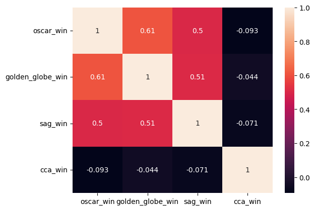

# 
 The Oscar Race 

## 
 Want to see the Oscar race? Check out this project 

Since we are in the Oscar season, to make the wait more enjoyable I have created this project to analyze the Oscar race. I have compiled, filtered, cleaned and graphed information about the awards, from 1990 to 2020, that I consider most relevant to this race; Golden Globes, SAG (Screen Actor Guild Awards), Critics' Choice Movie Awards and of course the Oscars. In order to see the correlation of the awards and in the future, be able to make a predictive analysis of the winners, and keep it updated!

## Table of Contents
1. [Getting Started](#getting-started)
2. [Usage](#usage)
3. [Analysis](#analysis)
4. [Documentation](#documentation)
5. [Support](#support)

## Getting Started

### Prerequisites

- [Python](https://www.python.org/downloads/) 3.8 or later
- [pip](https://pip.pypa.io/en/stable/installation/)
- [Virtualenv](https://virtualenv.pypa.io/en/latest/) (optional)

### Installation

1. Clone the repository:
https://github.com/JN2187/Oscar_Race.git
2. Create a virtual environment (optional but recommended)

### Dependencies

This project depends on the following libraries:
- pandas
- re
- [requests](https://pypi.org/project/requests/)
- [BeautifulSoup](https://pypi.org/project/beautifulsoup4/)
- [fuzzywuzzy](https://pypi.org/project/fuzzywuzzy/)
- [seaborn](https://pypi.org/project/seaborn/)
- [pymongo](https://pypi.org/project/pymongo/)

### Troubleshooting

- If you run into issues installing the dependencies, make sure you have the latest version of pip and try again.

## Usage

Folder scheme: Inside Oscar_Race you can find a data folder, which contains all the csv files of this project. The ones I have used for the cleanup taken from [Kaggle](https://www.kaggle.com/);
- [the_oscar_award](https://www.kaggle.com/datasets/unanimad/the-oscar-award)
- [golden_globe_awards](https://www.kaggle.com/datasets/unanimad/golden-globe-awards)
- [screen_actor_guild_awards](https://www.kaggle.com/datasets/unanimad/screen-actors-guild-awards)

The ones I've created from these, with their respective cleaning and standardization;
- [Oscar_clean](data/Oscar_clean.csv)
- [Golden_Globes_clean](data/Golden_Globes_clean.csv)
- [SAG_clean](data/AG_clean.csv)

Also the ones I´ve created from [wikipedia's](https://en.wikipedia.org/wiki/Critics%27_Choice_Movie_Awards#Categories) web scraping and their respective cleaning and standardization;
- [Best_Picture_soup_cca](data/Best_Picture_soup_cca.csv)
- [Actor_In_A_Leading_Role_soup_cca](data/Actor_In_A_Leading_Role_soup_cca.csv)
- [Actor_In_A_Supporting_Role_soup_cca](data/Actor_In_A_Supporting_Role_soup_cca.csv)
- [Actress_In_A_Leading_Role_soup_cca](data/Actress_In_A_Leading_Role_soup_cca.csv)
- [Actress_In_A_Supporting_Role_soup_cca](data/Actress_In_A_Supporting_Role_soup_cca.csv)
- [CCA_clean](data/CCA_clean.csv)

And all awards gathered in a single csv:
- [Cinema_Awards](data/Cinema_Awards.csv)

And finally a heatmap obtained form our analysis:
- [Output](data/output.png)

In the notebooks folder you can find the code I've used for;

The cleaning
- [CCA_Clean](notebooks/CCA_Clean.ipynb)
- [Cinema_Award_clean](notebooks/Cinema_Award_clean.ipynb)
- [Golden_Globes_Clean](notebooks/Golden_Globes_Clean.ipynb)
- [Oscar_Clean](notebooks/Oscar_Clean.ipynb)
- [SAG_Clean](notebooks/SAG_Clean.ipynb)

Web scraping:
- [BeautifulSoup_actors](notebooks/BeautifulSoup_actors.ipynb)
- [BeautifulSoup_actress](notebooks/BeautifulSoup_actress.ipynb)
- [BeautifulSoup_picture](notebooks/BeautifulSoup_picture.ipynb)
- [BeautifulSoup_sup_actor](notebooks/BeautifulSoup_sup_actor.ipynb)
- [BeautifulSoup_sup_actress](notebooks/BeautifulSoup_sup_actress.ipynb)

Storage Visualization:
- [Mongo_And_Visualization](notebooks/Mongo_And_Visualization.ipynb)

In the src folder there is a .py document called [support](src/support.py) where all the functions that I have created for this project are collected.

## Analysis

In this project I have compiled information on the following categories, Best Actor and Actress, both lead and supporting, Best Director, Best Picture, Best Screenplay, both adapted and original since 1990 to 2020.

My hypothesis is that the winners and nominees of the pre-Oscar awards give a lot of information about who is most likely to get it.

The awards that have the highest correlation with the Oscars are the values closest to 1, in this case we can see that the winners of a Golden Globe as well as the SAGs have a positive value close to 1, therefore we can say that having won one of these has a direct effect on obtaining an Oscar. As well as having obtained a Critics' Choice Award does not have such an impact on the result, since its correlation is negative and close to 0.

## Documentation

In this project I have used the following Python libraries: 
- pandas
- re
- [requests](https://pypi.org/project/requests/)
- [BeautifulSoup](https://pypi.org/project/beautifulsoup4/)
- [fuzzywuzzy](https://pypi.org/project/fuzzywuzzy/)
- [pymongo](https://pypi.org/project/pymongo/)
- [seaborn](https://pypi.org/project/seaborn/)

### Support

If you have any questions or run into any issues, please contact me at juanoncorrea@gmail.com

## 
Enjoy! 🙌

